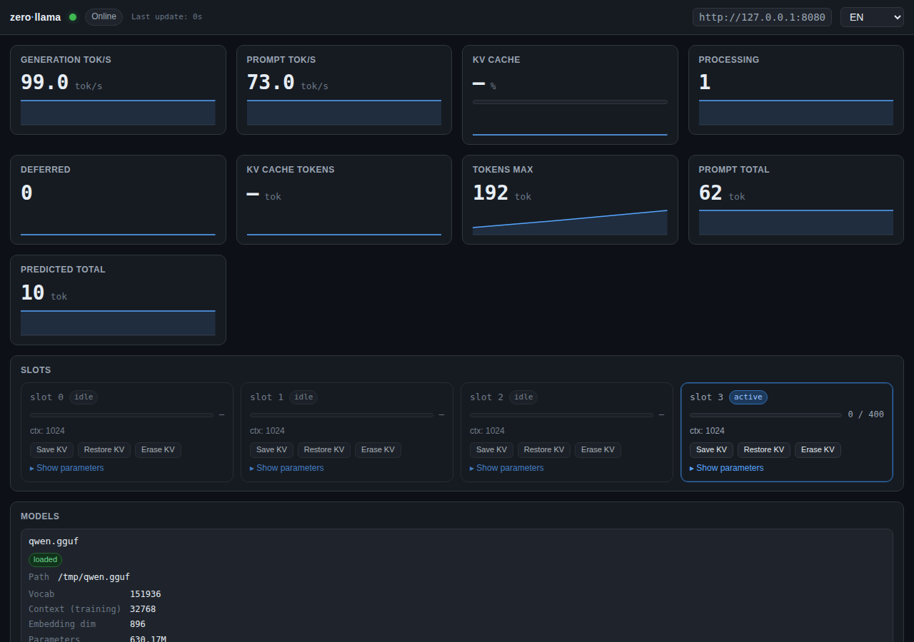
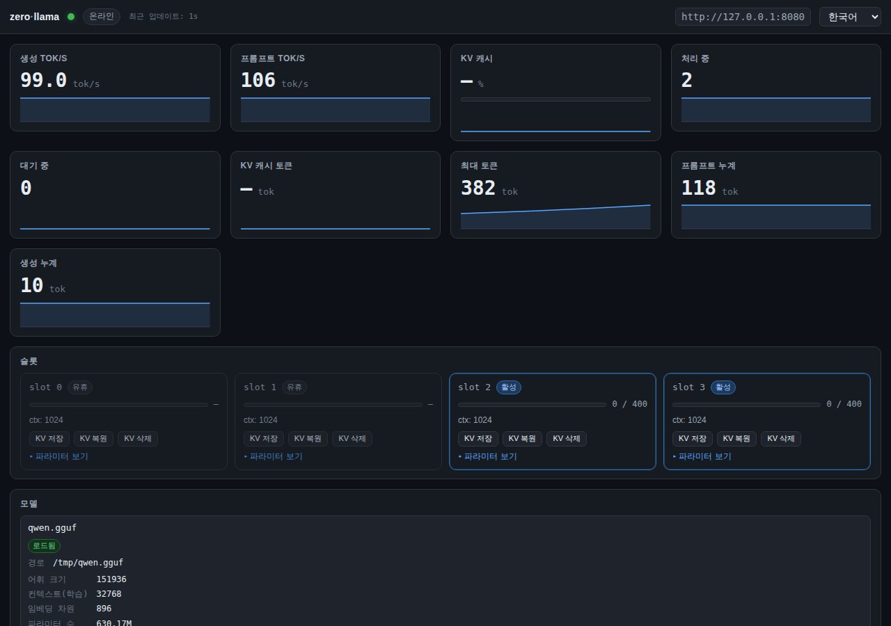
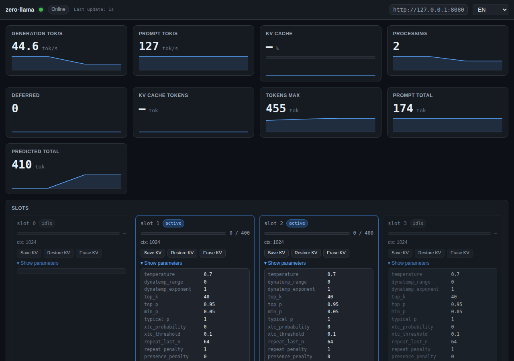
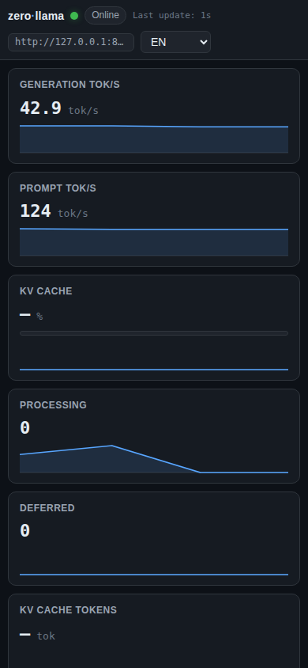

# zerollama-dashboard

A zero-dependency, single-HTML-file monitoring dashboard for
[llama.cpp](https://github.com/ggml-org/llama.cpp) servers.

> Languages: **English** · [한국어](README.ko.md) · [日本語](README.ja.md) · [简体中文](README.zh-CN.md) · [Español](README.es.md)

> Inspired by [abhiFSD/llama.cpp-Monitor-Dashboard](https://github.com/abhiFSD/llama.cpp-Monitor-Dashboard) (MIT).
> No npm, no CDN, no localStorage. Just one HTML file.

## Screenshots






## What it shows

- Live `/metrics` (Prometheus): generation tok/s, prompt tok/s, KV cache
  usage, processing/deferred requests, cumulative counters
- `/slots`: per-slot state with full sampling parameters
  (temperature, top_k, top_p, min_p, repeat penalty, mirostat, DRY, etc.)
- `/props` + `/v1/models`: model metadata (vocab/context/embedding
  dimensions, parameter count, chat template, modalities, build info)
- `/lora-adapters`: loaded LoRA adapters with scales
- `/models` (router mode): all cached models with status (loaded /
  loading / unloaded / sleeping / failed) and the **actual CLI args
  used to launch each model**
- Optional `server.log` tail via HTTP Range (auto-detected; hidden
  if not available)
- **Inline guidance**: each card carries an ⓘ tooltip with the
  underlying parameter explained; suggestions appear when state
  crosses thresholds (e.g. "KV cache 96% — consider raising
  `--ctx-size` or reducing `--parallel`")

## Quick start

### Option A — same origin as llama-server

```bash
mkdir -p ./public
cp monitor.html ./public/
llama-server -m model.gguf --metrics --port 8080 --path ./public
# open http://localhost:8080/monitor.html
```

### Option B — point at a remote server

Open `monitor.html` from any static file server (e.g. `python3 -m
http.server`) and pass `?server=`:

```
http://localhost:8000/monitor.html?server=http://10.0.0.5:8080
```

The remote `llama-server` must allow CORS (default is permissive).

### Router (multi-model) mode

Launch `llama-server` **without** `-m`:

```bash
llama-server --models-dir ./models --metrics --port 8080
```

The dashboard auto-detects router mode by probing `GET /models`. A model
selector appears in the header.

## URL parameters

| Param | Default | Purpose |
|---|---|---|
| `server` | same origin | llama-server base URL |
| `model` | (none) | router mode: default selected model |
| `poll` | `1000` | polling interval, ms |
| `log` | auto | log file path; auto-detect if not specified, panel hidden if not reachable |
| `lang` | auto | `en` / `ko` / `ja` / `zh-CN` / `es` (defaults from browser) |

Settings live in the URL only — no localStorage. Share a link, get the
same view.

## Optional: log tail

The log panel reads the last ~64 KB of a static file via `Range:
bytes=-65536`. For it to work, **all three** must hold:

1. llama-server's stdout/stderr is redirected to a file:
   ```bash
   llama-server ... --path ./public > ./public/server.log 2>&1
   ```
   (systemd / docker default to stdout — no file is created.)
2. That file is served from the same origin as `monitor.html`.
3. The HTTP server supports `Range` (cpp-httplib and nginx do).

If any condition fails, the panel hides itself silently. Override the
path with `?log=path/to/file`. Disable explicitly with `?log=`.

## Requirements on llama-server

- Build/binary recent enough to expose `/metrics`, `/slots`, `/props`,
  `/v1/models`, `/lora-adapters` (all standard).
- Run with `--metrics` to expose `/metrics`.
- `--slots` is on by default; do not pass `--no-slots`.
- For router mode: launch without `-m`, with `--models-dir` or
  `--models-preset`.

## Guidance rules (excerpt)

| Signal | Threshold | Suggestion |
|---|---|---|
| KV cache usage | > 90% sustained | Raise `--ctx-size`, lower `--parallel`, or enable `--ctx-shift` |
| Deferred requests | > 0 sustained | Raise `--parallel` or reduce client concurrency |
| Generation tok/s low + slots idle | — | Increase `--n-gpu-layers` |
| `is_sleeping` true | — | First request will reload the model — tune `--sleep-idle-seconds` |
| Slot `temperature` 0 | — | Greedy decoding (deterministic) |
| Slot `temperature` > 1.5 | — | Quality may degrade; ≤1.0 typical |
| Slot `repeat_penalty` > 1.3 | — | May break formatting; 1.05–1.15 typical |
| Slot `mirostat` ≠ 0 | — | top_p / top_k are ignored |
| Router model `failed` | — | Inspect `exit_code`; check args / VRAM |

Full ruleset rendered in the dashboard's "Active suggestions" panel
when triggered.

## License

[MIT](LICENSE). Inspired by
[abhiFSD/llama.cpp-Monitor-Dashboard](https://github.com/abhiFSD/llama.cpp-Monitor-Dashboard).
